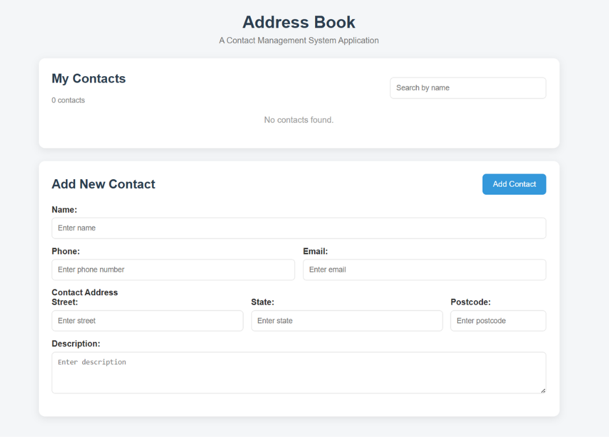
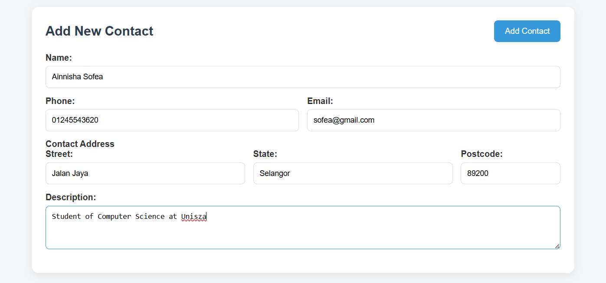
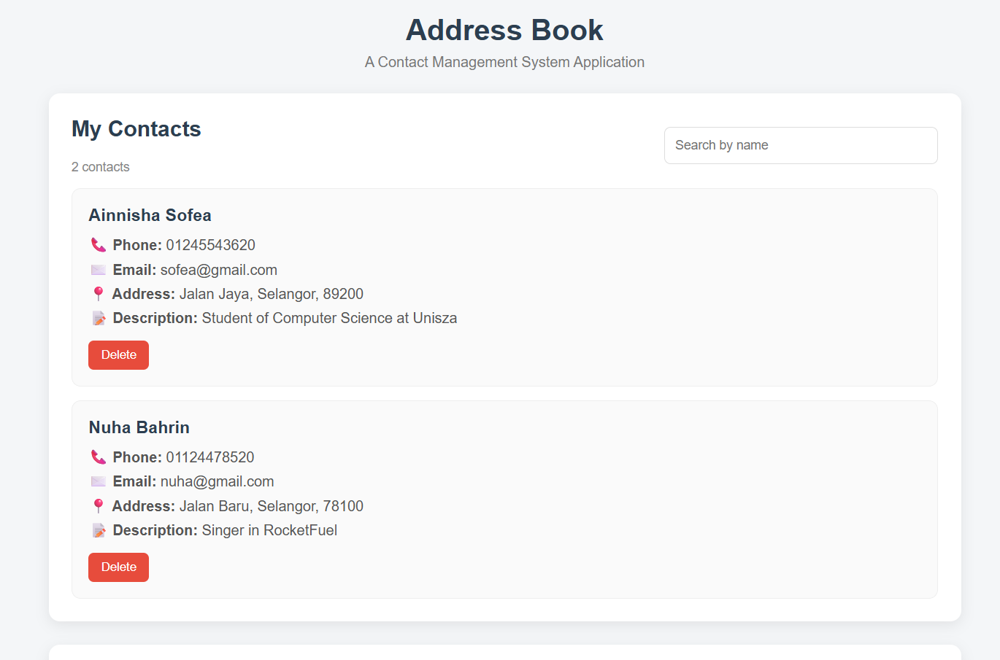
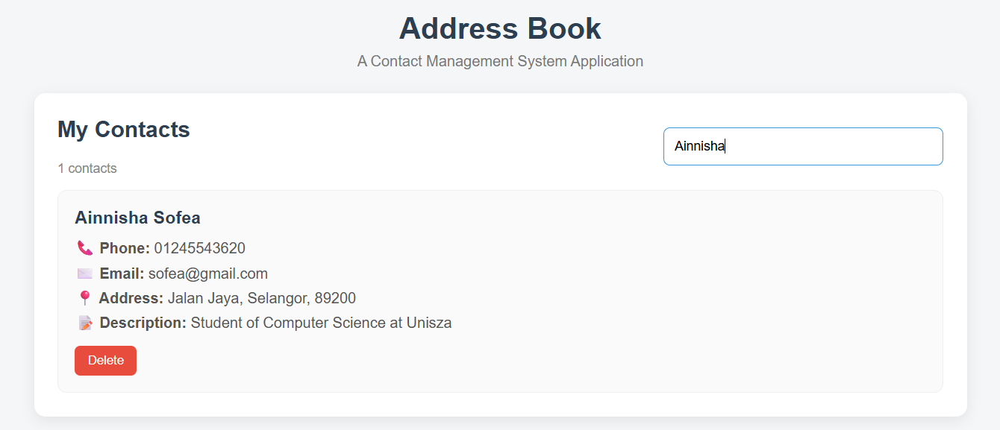
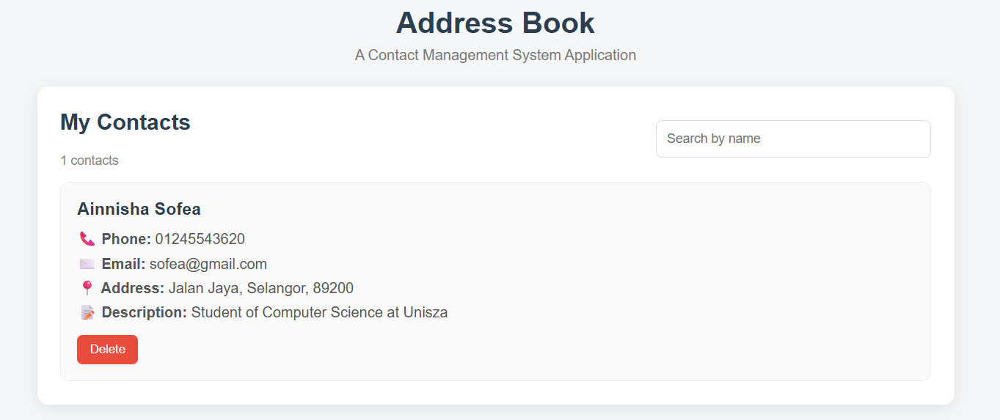

# Datum Web Developer Intern Assessment - Address Book Application

## Address Book Application Interface



## Description

Address Book Application is a simple web application developed using HTML, CSS and JavaScript. It allows users to manage contact information through basic functions such as adding, viewing, searching and deleting contacts. All contact data is stored temporarily in a JavaScript array without using a backend or database.

## Technologies Used

* HTML - Used to create the page layout structure and form elements of the application.
* CSS - Used to design and style the user interface.
* JavaScript - Used to implement the application logic and contact management functions.

## Main Functions

### 1. Add Contact

Users can add a new contact by entering the required information such as name, phone number, email, address, and description and clicking the 'Add Contact' button. When the form is submitted, the contact is stored as an object inside the JavaScript contacts array.



### 2. View Contacts

All stored contacts are displayed in the "My Contacts" section. Each contact displays its name, phone number, email, address (street,state,poscode), description and with a 'Delete' button.



### 3. Search Contact

Users can search for a contact by entering the person's name in the search field. The application filters the contacts array and displays only the contacts that match the search keyword.



### 4. Delete Contact

Users can remove a contact by clicking the 'Delete' button. Each contact has a unique ID and JavaScript uses the ID to identify and remove the selected contact from the contacts array.

Before:


After:


## How It Works

The application will stores all contact information in an in-memory JavaScript array. Each contact will be represented as an object that containing its own ID, name, phone, email, address (street,state,poscode) and description.

It works when a user want to add a contact, a new object then will be created and added to the array. Next, the application will displays with the data that consists with the updated contact list. Futhermore, for the searching function, the filter() method is used to find contacts based on their name. Lastly, for the deletion function, the contact's unique ID is used to remove the selected contact from the array.

Note: Contact data is stored in memory using a JavaScript array as required which no database, backend or external storage is used. Therefore, the data will be cleared when the webpage is refreshed or closed. 

## How to Run the Project

1. Clone or download the repository

```bash
git clone https://github.com/nnshaaa/DatumWebDeveloperInternAssessment---AddressBookApplication.git
```

2. Open the project folder

3. Open index.html in a web browser.

4. Configure the project environment if needed

5. Start adding and managing contacts.

## Author

AINNISHA SOFEA BINTI AZAHAN
BACHELOR OF COMPUTER SCIENCE (SOFTWARE DEVELOPMENT) WITH HONOURS
UNIVERSITI SULTAN ZAINAL ABIDIN (UNISZA)